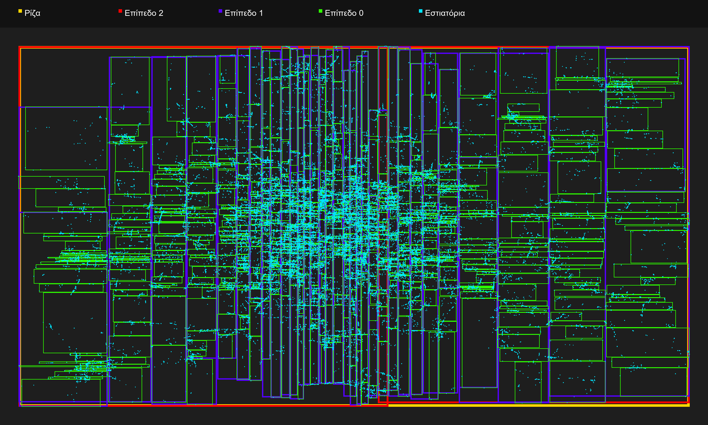
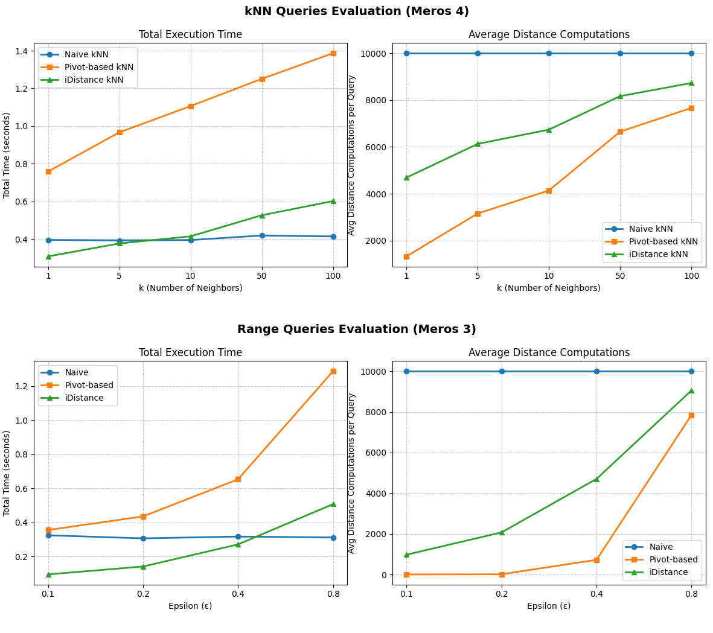

# Complex Data Management: Indexing, Joins & Similarity Search 🗄️🚀

A repository containing three advanced database projects focusing on **Query Optimization**, **Spatial Indexing (R-Trees)**, and **High-Dimensional Vector Search (iDistance)**.
Developed for the *Complex Data Management (MYE041)* course at the **University of Ioannina**.


## 📂 Project 1: Query Estimation & Join Algorithms

An exploration of query selectivity estimation using histograms and a performance evaluation of various Join operators on real-world aviation data.

### 🎯 Objective
To build statistical summaries (histograms) for query result estimation and to implement and optimize Relational Algebra join operators (Semi-joins, Anti-semijoins).

### 🛠️ Methodology
* **Histograms:** Implemented both Equi-Width and Equi-Depth histograms to estimate the selectivity of range queries on an age dataset.
* **Join Operators:** Developed Hash-based and Sort-Merge algorithms for Semi-joins and Anti-semijoins. 
* **Pipelining & 3-Way Joins:** Implemented a concurrent 3-way Sort-Merge join and a Pipelined Merge Join to avoid writing intermediate results to the disk.

### 📊 Key Findings
* **Equi-Depth Superiority:** The Equi-Depth histogram proved more resilient to skewed data distributions compared to Equi-Width, providing consistently lower estimation errors.
* **Filter Push-Down:** Applying selection filters (e.g., aircraft type) before executing the join drastically reduced the input size and optimized execution time.
* **I/O Optimization:** Pipelining successfully prevented I/O bottlenecks by establishing a continuous stream of tuples between operators.

---

## 🌍 Project 2: Spatial Data Indexing with R-Trees

Development of a main-memory spatial index to efficiently evaluate geographic queries on a dataset containing 51,970 restaurant locations in Beijing.

### 🎯 Objective
To construct an R-Tree using the Sort-Tile-Recursive (STR) bulk-loading algorithm and utilize it for fast spatial query evaluation.

### ⚙️ Implementation Details
* **STR Construction:** Sorted the raw points by X-axis into vertical slices, and then by Y-axis into tiles to group geographically proximate points into Minimum Bounding Rectangles (MBRs).
* **Window & Distance Queries:** Implemented recursive depth-first search (DFS) algorithms to find points within specific bounding boxes or Euclidean radii.
* **k-Nearest Neighbors (kNN):** Utilized a Priority Queue (Min-Heap) for an incremental nearest neighbor search, evaluating MBR distances dynamically.

### 📊 Key Findings
* The STR bulk-loading approach yielded an optimally packed R-Tree with zero node underflow and minimized MBR overlap.
* MBR pruning allowed the algorithm to discard massive portions of the dataset instantly, significantly outperforming linear coordinate scanning.

### 📸 Spatial Results


---

## 🔍 Project 3: High-Dimensional Vector Search & iDistance

A comparative study on defeating the "curse of dimensionality" using metric space indexing for 10D vectors.

### 🎯 Objective
To perform Range and kNN similarity queries on 10,000 dense 10-dimensional vectors, evaluating three different algorithmic approaches: Linear Scan, Pivot-based, and iDistance.

### 🛠️ Methodology
* **Baseline:** Implemented a Naive Linear Scan computing exact Euclidean distances for all points.
* **Pivot-Based Search:** Utilized a Max-Sum heuristic to select reference points (pivots) and applied the Triangle Inequality to mathematically prune invalid vectors without computing exact distances.
* **iDistance:** Mapped the 10D space into a 1-Dimensional B+-Tree-like array. Queries were transformed into 1D bounds and searched in $O(\log N)$ time using Binary Search (`bisect`).

### 📊 Key Findings
* **iDistance Dominance:** The iDistance method was by far the fastest and most scalable solution for both Range and kNN queries, leveraging binary search to completely bypass evaluating irrelevant partitions.
* **The Pivot Paradox:** While the Pivot-based method executed the absolute minimum number of mathematical distance computations, it suffered in total execution time due to the iterative overhead of checking multiple Triangle Inequalities in Python.
* **Dynamic Pruning in kNN:** Utilizing a Max-Heap to track the $k$-th best distance allowed the search radius ($\epsilon$) to dynamically shrink, dramatically accelerating the pruning process in later stages of the dataset.

### 📸 Performance Metrics
*(Add your own screenshot of the plots from the report here)*


---

## 🚀 How to Run

Before executing any script, ensure you have **Python 3** installed. All implementations strictly use the Python Standard Library, meaning **no external packages** (such as pandas or numpy) are required.

---

### 📂 Set 1: Histograms & Join Evaluation
Navigate to the corresponding directory:
```bash
cd set_1_histograms_joins
```

**📊 Exercise 1: Histograms & Query Estimator**
* **Step 1:** Generate the histograms by running:
  ```bash
  python 1.1_histograms.py
  ``` 
  This reads the age data, prints ASCII charts, and outputs the `histograms_output.txt` metadata file.
* **Step 2:** Run the estimator using: 
  ```bash
  python 1.2_estimator.py <min_age> <max_age>
  ```
  Example: `python 1.2_estimator.py 25 40`.

**🗄️ Exercise 2: Join Algorithms**
* **Part 2.1 (Hash & Sort-Merge Tests):** Run: 
  ```bash
  python askisi2_1.py
  ```
  to execute correctness tests for the semi-join and anti-semijoin operators.
* **Part 2.2 (Airport Data Queries):** Pass the aircraft type as a command-line argument. Example: 
  ```bash
  python askisi2_2.py 737
  ```
* **Part 2.3 (Pipelining & 3-Way Join):** Run: 
  ```bash
  python askisi2_3.py
  ```
  to verify that the pipelined approach and the concurrent 3-way sort-merge produce identical results.

---

### 📂 Set 2: Spatial Data Indexing with R-Trees
Navigate to the corresponding directory:
```bash
cd set_2_spatial_rtree
```

**🌳 Part 1: R-Tree Construction**
* Build the tree using the STR bulk-loading algorithm by running: 
  ```bash
  python rtree.py Beijing_restaurants.txt rtree.csv
  ```
  This will export the structure to a CSV and print tree statistics.

**🔍 Part 2: Spatial Queries**
* **Window Range Queries:** Run: 
  ```bash
  python queries.py rtree.csv windowRangeQueries.txt
  ```
* **Distance Range Queries:** Run: 
  ```bash
  python queries.py rtree.csv distanceRangeQueries.txt
  ```
* **k-NN Queries:** Provide the *k* value as the third argument (defaults to 10). Example: 
  ```bash
  python queries.py rtree.csv NNQueries.txt 10
  ```

---

### 📂 Set 3: High-Dimensional Vector Search & iDistance
Navigate to the corresponding directory:
```bash
cd set_3_vector_search
```

**⚙️ Execution Details**
* Ensure `vector_search.py`, `data10K10.txt`, and `queries10.txt` are located in the same folder.
* The script requires three arguments: `<number_of_pivots> <search_radius_epsilon> <number_of_neighbors_k>`.
* **Example Run:** Run: 
  ```bash
  python vector_search.py 10 0.2 5
  ```
  to evaluate the queries with 10 pivots, a radius of 0.2, and 5 nearest neighbors. The script will execute the Naive, Pivot-based, and iDistance methods sequentially and output comparative metrics.
